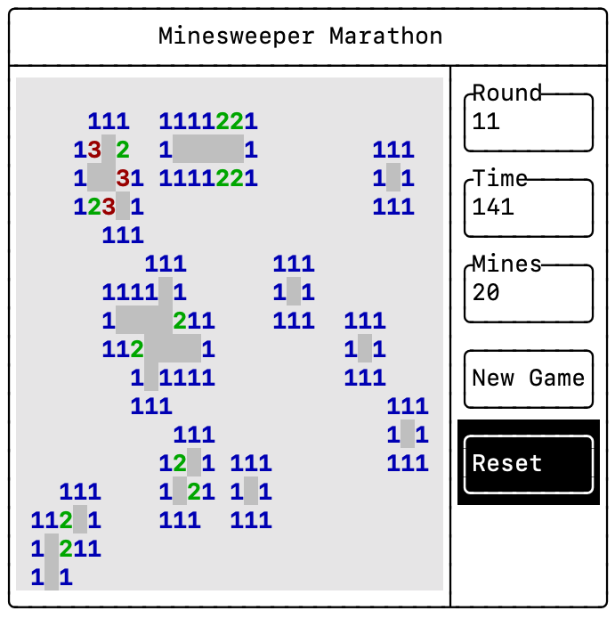

# Minesweeper Marathon

[](https://github.com/ebarlas/minesweeper_ftxui/actions/workflows/ci.yml)
[](https://codecov.io/gh/ebarlas/minesweeper_ftxui)
[](https://github.com/ebarlas/minesweeper_ftxui/actions/workflows/codeql-analysis.yml)

## Overview
Minesweeper Marathon is an adaptation of [Minesweeper](https://en.wikipedia.org/wiki/Microsoft_Minesweeper)
with a timer and rounds of increasing difficulty.

This repository was initially generated from the [C++ Best Practices GitHub template](https://github.com/cpp-best-practices/ftxui_template) 
for participation in the [April 2022 C++ Best Practices Game Jam](https://github.com/cpp-best-practices/game_jam/tree/main/Jam1_April_2022).

Play in the browser at https://barlasgarden.com/minesweeper/index.html



# Gameplay

#### Goal
Achieve the highest round in the time allotted.

#### Rules
The original [Minesweeper](https://en.wikipedia.org/wiki/Microsoft_Minesweeper) gameplay 
within a grid of tiles remains unchanged. Reveal all non-mine tiles as quickly
as possible. 

However, when a single board is completed, the game continues with a 20-second time bonus and
another board that has an additional mine. This process continues until time expires.

Additionally, an individual board can be reset to restart the current round. Progress is
not lost if a mine is revealed!

#### Controls:

* Left click covered tile to reveal
* Click (left or right) revealed number with correct number of flagged neighbors to clear remaining neighbors
* Right click or key press while hovering covered tile to flag

# Resources

### Source Code

#### Files

* [bitmap.h](src/bitmap.h), [bitmap.cpp](src/bitmap.cpp) - `Bitmap` class for modeling grid of pixels
* [board.h](src/board.h), [board.cpp](src/board.cpp) - `Board` class for modeling Minesweeper board
* [game.h](src/game.h), [game.cpp](src/game.cpp) - `Game` class for modeling Minesweeper Marathon game
* [minesweeper.cpp](src/minesweeper.cpp) - `main` function for launching a game in an FTXUI layout

#### Initialize
```
cmake -S . -B ./build
```

#### Build
```
make VERBOSE=1
```

#### Test
```
ctest -C Debug
```

### Emscripten and WebAssembly

The [Emscripten](https://emscripten.org/) toolchain emits WebAssembly suitable for inclusion in web pages.

Fortunately, [FTXUI](https://github.com/ArthurSonzogni/FTXUI/) supports Emscripten and even includes a range of examples compiled as Wasm.

An online version is available at https://barlasgarden.com/minesweeper/index.html

#### Files

* [CMakeLists.txt](emscripten/CMakeLists.txt) - CMake file tailored for Emscripten compilation
* [index.html](emscripten/index.html) - Webpage with minesweeper Wasm module for in-browser game play
* [highscores.html](emscripten/highscores.html) - Webpage with high score board
* [run_webassembly.py](emscripten/run_webassembly.py) - Python script for starting a local web server that includes necessary response headers

#### Initialize
```
emcmake cmake -S . -B ./build
```

#### Build
```
emmake make VERBOSE=1
```

#### Serve
```
python run_webassembly.py
```

### High Score Server

The Minesweeper Marathon high score service is a AWS Lambda Function written in Python.

The endpoints provided are `GET /scores` and `POST /scores`.

The AWS Lambda Function is attached to a CloudFront distribution.

#### Files:

* [lambda_function.py](server/lambda_function.py) - AWS Lambda Function Python script that implements simple high score REST API backed by DynamoDB